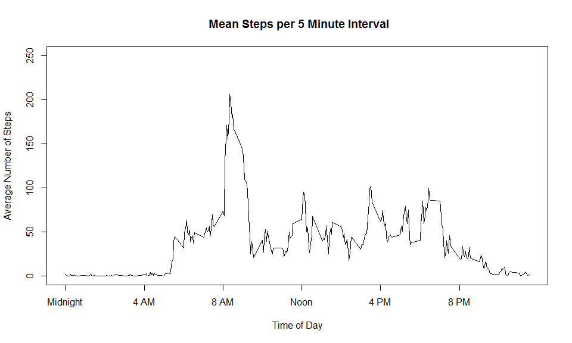
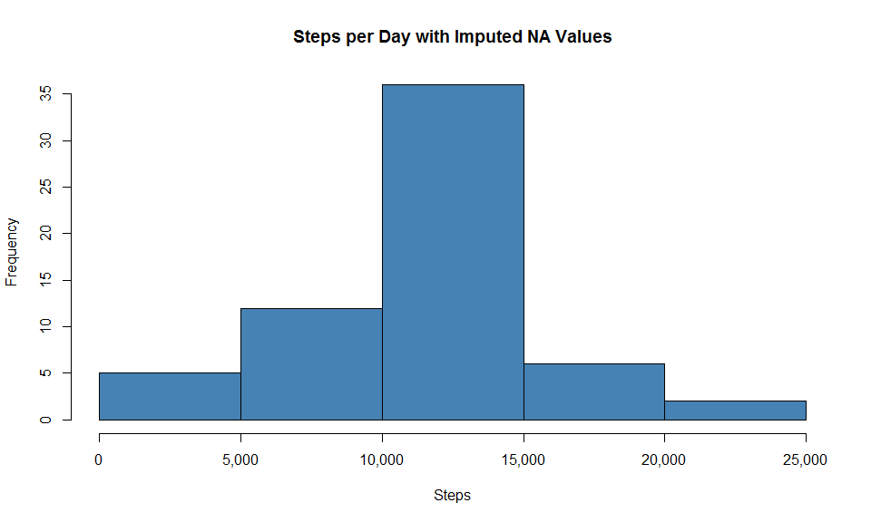
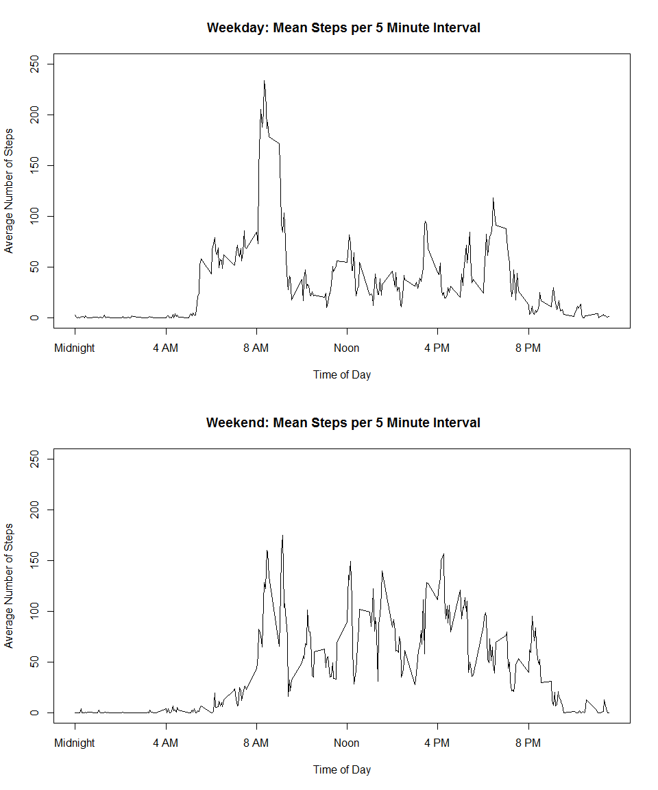

# Reproducible Research: Peer Assessment 1


## Loading and preprocessing the data
Load the csv file, convert the date column from string type to date type.

```r
df <- read.csv("./activity/activity.csv")
df$date <- as.Date(as.character(df$date),"%Y-%m-%d")
```


## What is mean total number of steps taken per day?

Calculate the number of steps taken each day:

```r
steps <- with(df, tapply(steps, date, sum))
```

A histogram of the steps per day shows an approximate normal distribution:

```r
hist(steps, main = "Steps per Day", xlab = "Steps", col="steelblue", xaxt = "n")
axis(1,at=seq(0,25000,5000), labels = c("0","5,000","10,000","15,000","20,000","25,000"))
```


```r
smean <- format(round(mean(steps, na.rm = TRUE),0), big.mark = ",")
smed <- format(round(median(steps, na.rm = TRUE),0), big.mark = ",")
```

The mean total number of steps per day is **10,766** and the median total number of steps is **10,765**. 


## What is the average daily activity pattern?

First, group the mean number of steps by 5 minute intervals across all days in the study:

```r
isteps <- with(df, tapply(steps, interval, mean, na.rm = TRUE))
```

A time series plot of daily mean step activity shows few steps before 5AM and after 10PM.  Peak activity  is in the morning from about 8AM to 9AM.

```r
plot(names(isteps),isteps,type="l",main=" Mean Steps per 5 Minute Interval", xlab = "Time of Day", ylab = "Average Number of Steps", xaxt = "n", ylim = c(0,250))
axis(1,at=c(0,400,800,1200,1600,2000), labels = c("Midnight","4 AM", "8 AM", "Noon", "4 PM", "8 PM"))
```




```r
hs <- names(which.max(isteps))
```

The highest average daily 5 minute interval occurs at **835** AM.


## Imputing missing values

Calculate how many missing values are in the data set:

```r
  sum(is.na(df$steps))
```

```
## [1] 2304
```

It turns out that there are 8 missing values for each interval.  This means 13.1% (8/61 days) of the data is missing.

Impute values for these missing entries.  Adopt the strategy of using the overall mean for the 5 minute interval that is missing, and create a new dataset that incorporates these values:

```r
#stepsv <- df$steps
dfcomplete <- df
# So a trick here.... use the average steps per 5 minute interval, but repeat it 61 times to match the length of the data set (61 days of intervals from 0 to 2350)
fill <- rep(isteps,61)
# replace na values with the corresponding value in the fill vector we just made
dfcomplete$steps[is.na(dfcomplete$steps)] <- fill[is.na(dfcomplete$steps)]
```


Calculate the number of steps taken each day with the revised data:

```r
steps2 <- with(dfcomplete, tapply(steps, date, sum))
```

The histogram of steps per day has the same shape as the original histogram that excluded the missing values.  This histogram with imputed values has a slightly larger magnitude because the eight missing data were replaced with mean values.

```r
hist(steps2, main = "Steps per Day with Imputed NA Values", xlab = "Steps", col="steelblue", xaxt = "n")
axis(1,at=seq(0,25000,5000), labels = c("0","5,000","10,000","15,000","20,000","25,000"))
```




```r
smean2 <- format(round(mean(steps2, na.rm = FALSE),0), big.mark = ",")
smed2 <- format(round(median(steps2, na.rm = FALSE),0), big.mark = ",")
```

The mean number of steps per day is **10,766** and the median is **10,766**. These values are nearly identical to the mean and median of the data with the missing values. There was not a significant impact because the missing values were replaced with the mean values.


## Are there differences in activity patterns between weekdays and weekends?

First calculate create a factor with "Weekday" or "Weekend" values from the date:

```r
wd <- weekdays(df$date)
wd[(wd=="Saturday"|wd=="Sunday")] <- "Weekend"
wd[(wd!="Weekend")] <- "Weekday"
df$wd <- as.factor(wd)
```

Now plot two time series using daily averages for weekdays and weekends.  There is a significant difference in the pattern: On weekends, activity is spread more evenly throughout the day and the pattern starts later.

```r
wdSteps <- with(df, tapply(steps, list(interval, wd), function(x) mean(x, na.rm = TRUE)))
par(mfrow=c(2,1))
#x <- sprintf("%04d",unique(df$interval))
#xl <- paste0(substr(x,1,2), ":", substr(x,3,4))

# weekday plot
plot(row.names(wdSteps),wdSteps[,1], type="l", main=" Weekday: Mean Steps per 5 Minute Interval", xlab = "Time of Day", ylab = "Average Number of Steps", xaxt = "n", ylim = c(0,250))
axis(1,at=c(0,400,800,1200,1600,2000), labels = c("Midnight","4 AM", "8 AM", "Noon", "4 PM", "8 PM"))
#weekend plot
plot(row.names(wdSteps),wdSteps[,2],type="l", main=" Weekend: Mean Steps per 5 Minute Interval", xlab = "Time of Day", ylab = "Average Number of Steps", xaxt = "n", ylim = c(0,250))
axis(1,at=c(0,400,800,1200,1600,2000), labels = c("Midnight","4 AM", "8 AM", "Noon", "4 PM", "8 PM"))
```


